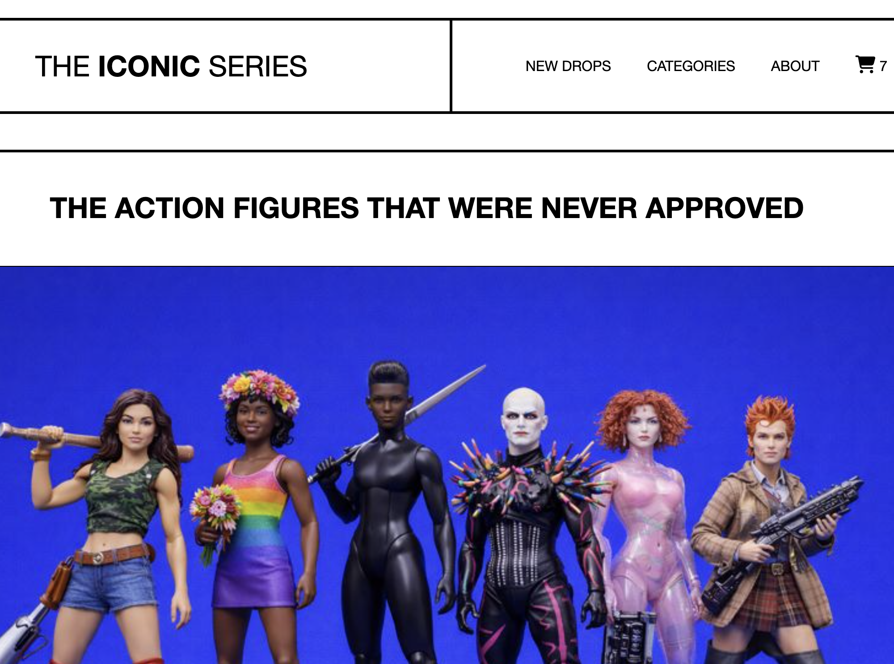
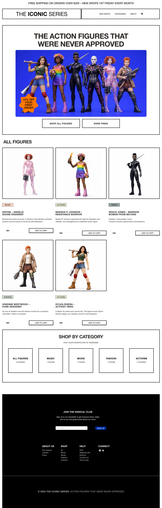
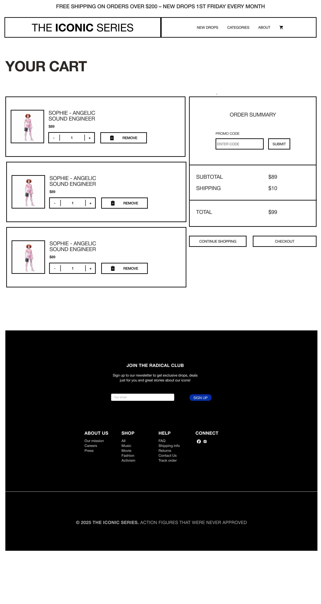

# The Iconic Series - an e-commerce site

## 💡 Overview

The Iconic Series is an e-commerce site selling action figures not allowed on other sites. Here, they are not only allowed - they are the stars.

This site is the result of a group project in the Front End Developer program at Medieinstitutet. It is for learning purposes only.

## 📘 Contents

- [Features](#features)
- [Planning](#planning)
  - [User Stories](#user-stories)
  - [Wireframes](#wireframes)
- [Tech stack](#tech-stack)
- [Getting started](#getting-started)
  - [Prerequisites](#prerequisites)

## ✨ Features

- **🔍 Filtering:** Filter the products based on their category, or choose to only see the new drops.
- **🛒 Cart:** You can stock up on how many products that you desire, they will be placed in your cart. You can always reach your cart from the header.
- **💳 Checkout:** Once you have filled your cart, continue to checkout! You will be met with a fully validated customer form and a choice to choose your shipping method.
- **📱 Responsive Design:** Access on any device with adaptive design.

## ✏️ Planning

### Agile Methods

In this project we used Scrum. That included: a kanban board with issues that were labeled,sprint plannings, daily standups, demos for the PO and retros after each sprint.

### Wireframes

The design of the page were made by [Lovisa Eklöf Örnestål ](https://github.com/lo-orn).

## 👩‍💻 Tech Stack

- **TypeScript**: A type safe language built on JavaScript.
- **SCSS**: A CSS extension language.
- **Vite**: A frontend build tool

## 📦 Getting Started

To get a local copy of this project up and running, follow these steps.

- Go to the [GitHub repo](https://github.com/mikael-johnsson/webbshop)
- Clone the repo
  - Click the green 'Code' button
  - Choose 'HTTPS' and copy the link
  - In your terminal, go to the directory on your computer where you want the clone to exist.
  - command 'git clone _the copied URL_'
- cd in to the project
- command 'npm i' - to install the dependencies
- command 'npm run dev' to run your local development server
- DONE! Your server should now be running on 'https://localhost:5173/

### 🚀 Prerequisites

- **Vite** To be able to run the local development server
- **Npm** To be able to install the dependencies
